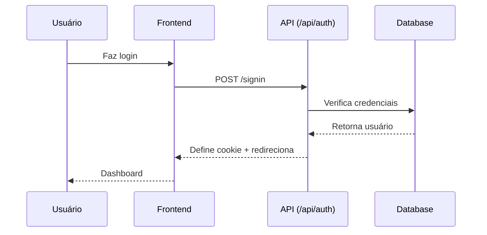
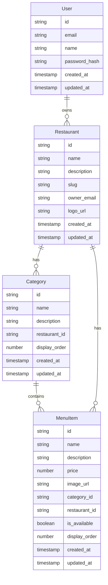

# Guia Técnico - Arquitetura do Sistema

Este documento descreve a arquitetura técnica do sistema de Cardápio Digital, incluindo componentes, padrões utilizados e decisões de design.

## 🏗️ Arquitetura Geral

O sistema segue uma arquitetura **Full-Stack JavaScript** com as seguintes camadas:

```
┌─────────────────┐
│   Frontend      │  ← Next.js Pages + React Components
├─────────────────┤
│   API Layer     │  ← Next.js API Routes
├─────────────────┤
│   Database      │  ← PostgreSQL (Neon)
└─────────────────┘
```

## 🛠️ Stack Tecnológico

### Frontend
- **Framework**: Next.js 14 com App Router
- **Linguagem**: TypeScript
- **Styling**: Tailwind CSS + Radix UI Components
- **Estado**: React Hooks + Server Components
- **Formulários**: React Hook Form + Zod validation

### Backend
- **API**: Next.js API Routes
- **Banco de Dados**: PostgreSQL via Neon Serverless
- **ORM**: SQL direto com queries parametrizadas
- **Autenticação**: Cookie-based sessions
- **Upload**: Vercel Blob Storage

### Infraestrutura
- **Deploy**: Vercel (recomendado)
- **Banco**: Neon PostgreSQL
- **Storage**: Vercel Blob
- **CDN**: Vercel Edge Network

## 📂 Estrutura do Projeto

```
cardapio-digital/
├── app/                    # Next.js App Router
│   ├── api/               # API Routes
│   │   ├── auth/          # Autenticação
│   │   ├── categories/    # CRUD de categorias
│   │   ├── menu-items/    # CRUD de itens do menu
│   │   ├── restaurants/   # CRUD de restaurantes
│   │   └── upload/        # Upload de arquivos
│   ├── dashboard/         # Dashboard administrativo
│   ├── login/            # Página de login
│   ├── menu/[slug]/      # Cardápio público
│   ├── globals.css       # Estilos globais
│   ├── layout.tsx        # Layout raiz
│   └── page.tsx          # Página inicial
├── components/           # Componentes React
│   ├── ui/              # Componentes base (Radix)
│   ├── dashboard-*/     # Componentes do dashboard
│   └── public-*/        # Componentes públicos
├── lib/                 # Utilitários e configurações
│   ├── auth.ts          # Funções de autenticação
│   ├── db.ts            # Conexão com banco
│   └── utils.ts         # Funções auxiliares
├── hooks/               # Custom React Hooks
├── public/              # Assets estáticos
└── scripts/             # Scripts SQL
```

## 🔐 Sistema de Autenticação

### Fluxo de Autenticação



### Cookies de Sessão
- **Nome**: `user_email`
- **HttpOnly**: Sim (segurança)
- **Secure**: Production only
- **SameSite**: Lax
- **Expiração**: 7 dias

## 🗄️ Modelo de Dados

### Entidades Principais



## 🔌 APIs Principais

### Endpoints de Autenticação
- `POST /api/auth/signin` - Login
- `POST /api/auth/signup` - Registro
- `POST /api/auth/signout` - Logout

### Endpoints de Restaurantes
- `GET /api/restaurants` - Listar restaurantes
- `POST /api/restaurants` - Criar restaurante
- `PUT /api/restaurants` - Atualizar restaurante

### Endpoints de Categorias
- `GET /api/categories` - Listar categorias
- `POST /api/categories` - Criar categoria
- `PUT /api/categories/[id]` - Atualizar categoria
- `POST /api/categories/[id]/reorder` - Reordenar categorias

### Endpoints de Itens do Menu
- `GET /api/menu-items` - Listar itens
- `POST /api/menu-items` - Criar item
- `PUT /api/menu-items/[id]` - Atualizar item
- `POST /api/menu-items/[id]/toggle` - Alternar disponibilidade

## 🎨 Interface do Usuário

### Dashboard Administrativo
- **Layout**: Sidebar + conteúdo principal
- **Navegação**: Menu lateral com ícones
- **Responsivo**: Design mobile-first
- **Componentes**: Tabelas, formulários, modais

### Cardápio Público
- **Layout**: Header + conteúdo do menu
- **Design**: Clean e elegante
- **Responsivo**: Otimizado para mobile
- **Funcionalidades**: Visualização de categorias e itens

## 🔧 Padrões de Desenvolvimento

### Validação de Dados
- **Frontend**: Zod schemas
- **Backend**: Validação manual + sanitização
- **Banco**: Constraints e triggers

### Tratamento de Erros
- **API**: Try-catch com respostas padronizadas
- **Frontend**: Error boundaries + toast notifications
- **Logs**: Console.error para debugging

### Upload de Arquivos
- **Storage**: Vercel Blob
- **Tipos**: Imagens (logo, pratos)
- **Validação**: Tipo, tamanho, dimensões

## 🚀 Performance

### Otimizações Implementadas
- **Server Components**: Para conteúdo dinâmico
- **Image Optimization**: Next.js Image component
- **Database**: Queries otimizadas com índices
- **Caching**: Cache de páginas estáticas

### Estratégias de Cache
- **Páginas públicas**: Cache por 1 hora
- **Dados do usuário**: Cache por sessão
- **Assets**: CDN automático do Vercel

## 🔒 Segurança

### Medidas de Segurança
- **SQL Injection**: Queries parametrizadas
- **XSS**: Sanitização de inputs
- **CSRF**: SameSite cookies
- **Authentication**: HttpOnly cookies
- **File Upload**: Validação de tipo e tamanho

### Validações
- **Email**: Formato válido
- **Senhas**: Mínimo 6 caracteres
- **Slugs**: Apenas caracteres alfanuméricos e hífen
- **Preços**: Valores numéricos positivos

## 📱 Responsividade

### Breakpoints
- **Mobile**: < 768px
- **Tablet**: 768px - 1024px
- **Desktop**: > 1024px

### Estratégias
- **Mobile-first**: CSS desenvolvido para mobile
- **Flexbox/Grid**: Layouts responsivos
- **Touch-friendly**: Botões e interações otimizados

## 🧪 Testes

### Estratégia de Testes
- **Unitários**: Funções utilitárias
- **Integração**: APIs e componentes
- **E2E**: Fluxos completos do usuário

### Ferramentas Sugeridas
- **Jest**: Testes unitários
- **Testing Library**: Testes de componentes
- **Cypress**: Testes E2E

## 📈 Monitoramento

### Logs
- **Erros**: Console.error detalhados
- **Performance**: Next.js built-in metrics
- **Banco**: Slow query logs

### Métricas
- **Response Time**: APIs
- **Error Rate**: Por endpoint
- **User Sessions**: Ativas e totais

## 🔄 Deploy

### Processo de Deploy
1. **Build**: `next build`
2. **Deploy**: Vercel automático
3. **Database**: Migrations automáticas
4. **Cache**: Invalidação automática

### Variáveis de Ambiente
- **DATABASE_URL**: Conexão PostgreSQL
- **BLOB_READ_WRITE_TOKEN**: Storage Vercel
- **NEXT_PUBLIC_APP_URL**: URL da aplicação